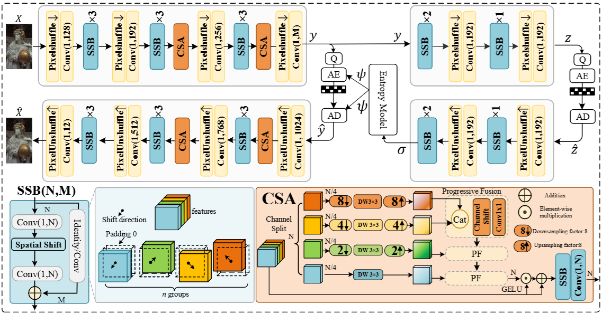
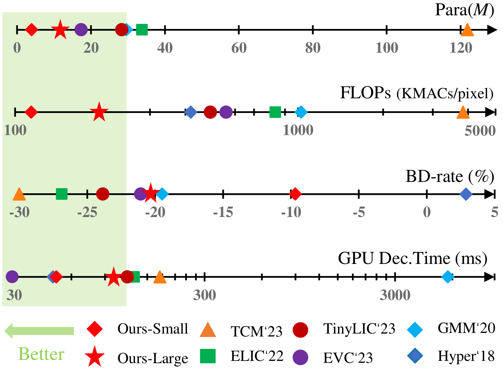
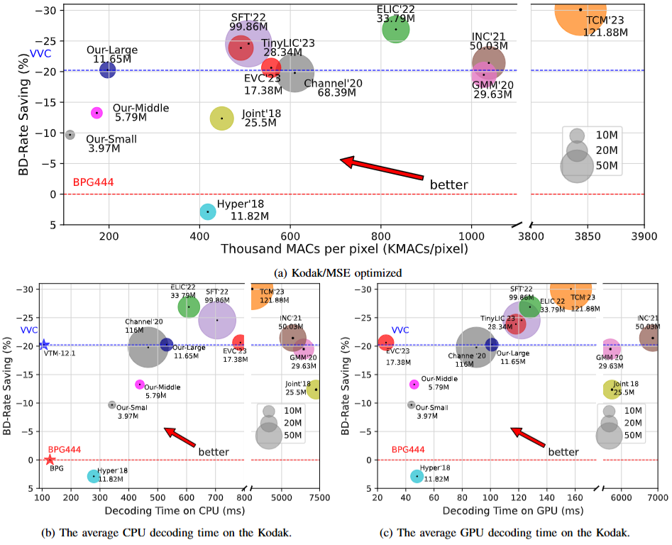

# Pytorch Implementation of "ShiftLIC: High-Efficiency Learned Image Compression with Spatial-Channel Shift Operations"

This repository contains the Pytorch implementation of the paper ["ShiftLIC: High-Efficiency Learned Image Compression with Spatial-Channel Shift Operations"](https://arxiv.org/abs/2503.23052) in IEEE Transactions on Circuits and Systems for Video Technology. 

// ... existing code ...

## TODO
- [ ] Provide pretrained models
- [ ] Offer supplementary materials

## Architectures
### **Figure 1: Overview of the ShiftLIC Architecture**  


## Results
### **Figure 2: Comprehensive Performance Comparison**


### **Figure 3: Rate-Distortion-Complexity-Latency Trade-off**


## Dependencies
To run this code, you will need the following dependencies:
- Pytorch 1.9
- CompressAI

You can install the necessary dependencies using the following command:
```bash
pip install torch==2.0.1 compressai=1.2.4
```

## Pretrained Models
Pretrained models will be made available soon. Stay tuned for updates.

## Training
To train the models, follow these steps:
1. Clone the repository:
    ```bash
    git clone https://github.com/baoyu2020/ShiftLIC.git
    cd ShiftLIC/shiftlic/large/
    ``` 

2. Prepare your dataset and adjust the configuration in `config.py`.
3. Run the training script:
    ```bash
    python train.py -q 1 --out_dir ./Log/out_dir/ --batch_size 16 --metric mse --lr 1e-4 --epochs 100 --dataset Train_dataset_dir 
    ```

## Testing
To test the models, follow these steps:
1. Run the testing script:
    ```bash
    python test.py --model_path ./Log/out_dir/model_best.pth --dataset Test_dataset_dir
    ```

2. The results will be saved in the `./Log/out_dir/` directory.

## Acknowledgements
This repository is based on [CompressAI](https://github.com/InterDigitalInc/CompressAI/) and [TinylLIC](https://github.com/lumingzzz/TinyLIC).


If you find this work useful for your research, please cite:

```

@article{10947057,
  author={Bao, Youneng and Tan, Wen and Jia, Chuanmin and Li, Mu and Liang, Yongsheng and Tian, Yonghong},
  journal={IEEE Transactions on Circuits and Systems for Video Technology}, 
  title={ShiftLIC: Lightweight Learned Image Compression with Spatial-Channel Shift Operations}, 
  year={2025},
  doi={10.1109/TCSVT.2025.3556708}}

```

```
@article{lu2022high,
  title={High-Efficiency Lossy Image Coding Through Adaptive Neighborhood Information Aggregation},
  author={Lu, Ming and Ma, Zhan},
  journal={arXiv preprint arXiv:2204.11448},
  year={2022}
}
```

## Contact
For any inquiries or issues, please contact us at [ynbao@stu.hit.cn](mailto:ynbao@stu.hit.cn).

---

We hope you find this repository useful. Contributions are welcome!
